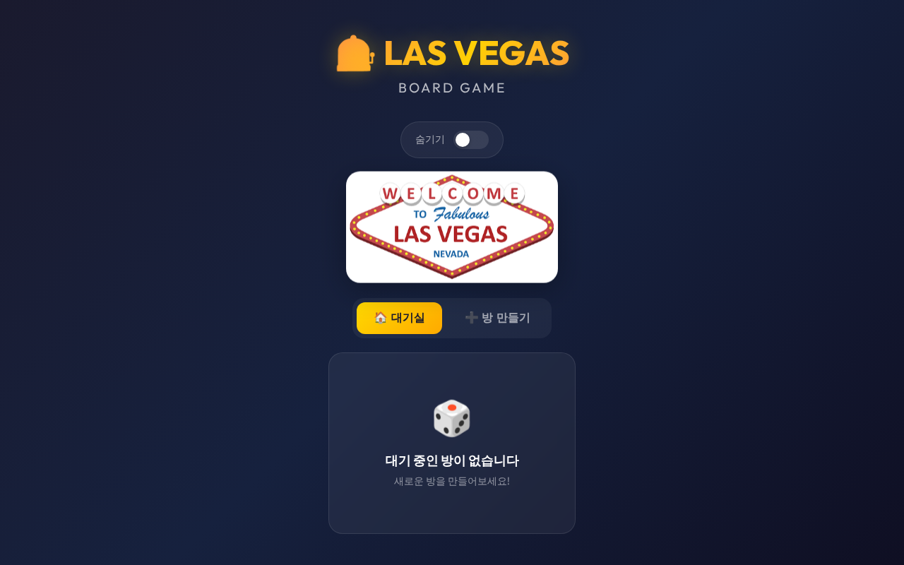
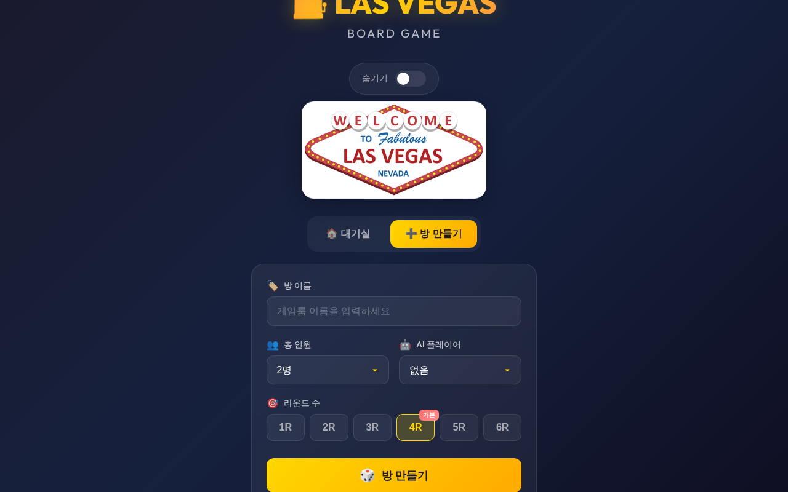
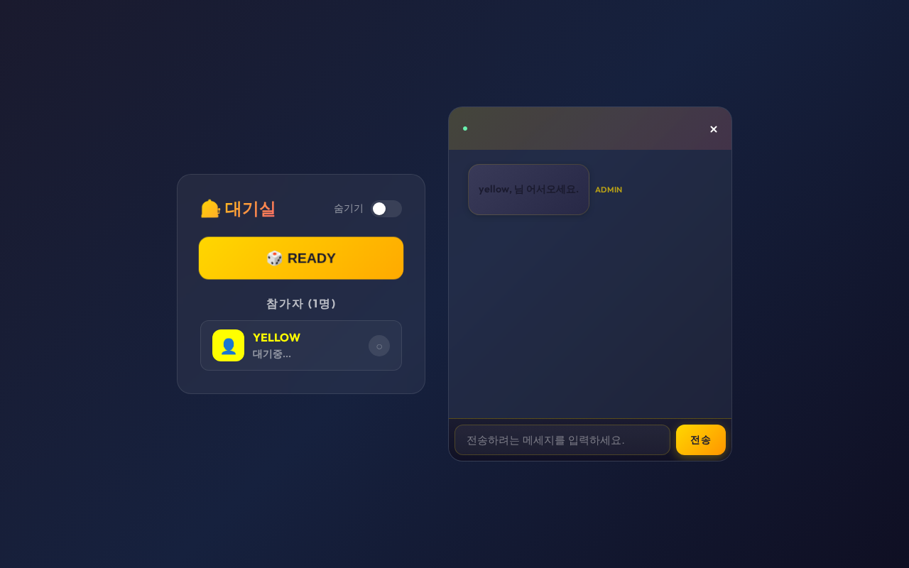
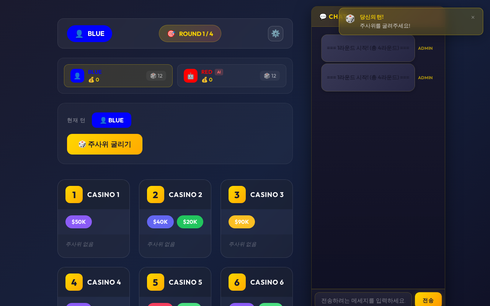

# Las Vegas - 온라인 보드게임

> 실시간 멀티플레이어 주사위 보드게임

**[DEMO](https://vegas.bellho.org)**

## 게임 소개

라스베가스는 2012년 발매된 주사위 보드게임을 웹으로 구현한 프로젝트입니다.
플레이어들은 주사위를 굴려 카지노에 배치하고, 가장 많은 배당금을 획득하는 것이 목표입니다.

### 게임 규칙 (간단 요약)

1. **주사위 굴리기** - 자신의 주사위를 모두 굴립니다
2. **숫자 선택** - 나온 숫자 중 하나를 선택합니다
3. **카지노 배치** - 선택한 숫자의 주사위를 해당 번호 카지노에 모두 배치합니다
4. **배당금 획득** - 라운드 종료 시 각 카지노에서 가장 많은 주사위를 놓은 플레이어가 배당금을 가져갑니다
5. **동점 상쇄** - 같은 개수의 주사위를 놓은 플레이어들은 서로 상쇄되어 무효 처리됩니다

> 4라운드 종료 후 가장 많은 돈을 모은 플레이어가 승리!

## 스크린샷

| 로비 | 방 만들기 |
|:---:|:---:|
|  |  |

| 대기실 | 게임 플레이 |
|:---:|:---:|
|  |  |

---

## 기술 스택

| 분류 | 기술 |
|------|------|
| **Frontend** | React 18, Zustand, Emotion, Framer Motion |
| **Backend** | Node.js, Express, Socket.io |
| **3D Graphics** | Three.js, Cannon-es (물리엔진) |
| **Deploy** | PM2, Cloudflare Tunnel |

## 주요 기능

### 실시간 멀티플레이어
- Socket.io 기반 실시간 양방향 통신
- 방 생성/참가 시스템
- 실시간 채팅

### AI 플레이어
- 최적의 수를 계산하는 AI 로직
- 1~4명의 AI와 함께 플레이 가능
- 혼자서도 게임 진행 가능

### 턴 타이머
- 30초 턴 제한 시스템
- 시간 초과 시 AI가 자동으로 플레이

### 3D 주사위
- Three.js를 활용한 3D 주사위 렌더링
- Cannon-es 물리엔진으로 사실적인 굴림 효과

### 반응형 UI
- 모바일/태블릿/데스크톱 지원
- 다크/라이트 모드
- 색맹 모드 지원

## 프로젝트 구조

```
lasvegas-game/
├── client/                 # React 프론트엔드
│   ├── src/
│   │   ├── components/     # UI 컴포넌트
│   │   │   ├── Ground/     # 게임 보드 (3D 주사위)
│   │   │   ├── Chat/       # 실시간 채팅
│   │   │   ├── Join/       # 방 생성/참가
│   │   │   └── ...
│   │   ├── stores/         # Zustand 상태관리
│   │   └── socket.js       # Socket.io 클라이언트
│   └── build/              # 프로덕션 빌드
│
└── server/                 # Express 백엔드
    ├── index.js            # 서버 엔트리 & Socket.io
    ├── users.js            # 유저/방/게임 로직
    └── util.js             # 유틸리티 함수
```

## 실행 방법

### 개발 환경

```bash
# 서버 실행
cd server
npm install
npm run dev

# 클라이언트 실행 (새 터미널)
cd client
npm install
npm start
```

### 프로덕션 배포

```bash
# 클라이언트 빌드
cd client
npm run build

# PM2로 서버 실행
cd server
pm2 start index.js --name "vegas-server"
```

## 개발 기간

- **기획 및 설계**: 1일
- **핵심 기능 개발**: 2일
- **AI 로직 구현**: 1일
- **UI/UX 개선**: 1일

---

## 라이선스

이 프로젝트는 학습 및 포트폴리오 목적으로 제작되었습니다.
